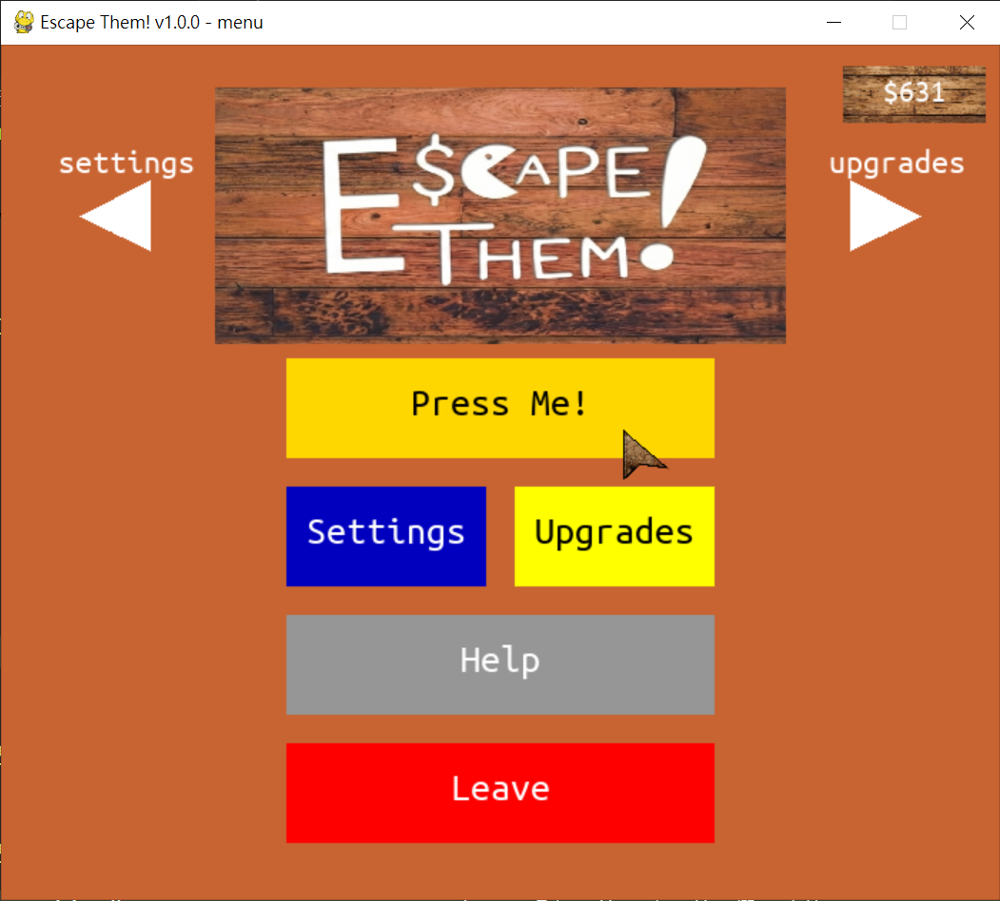
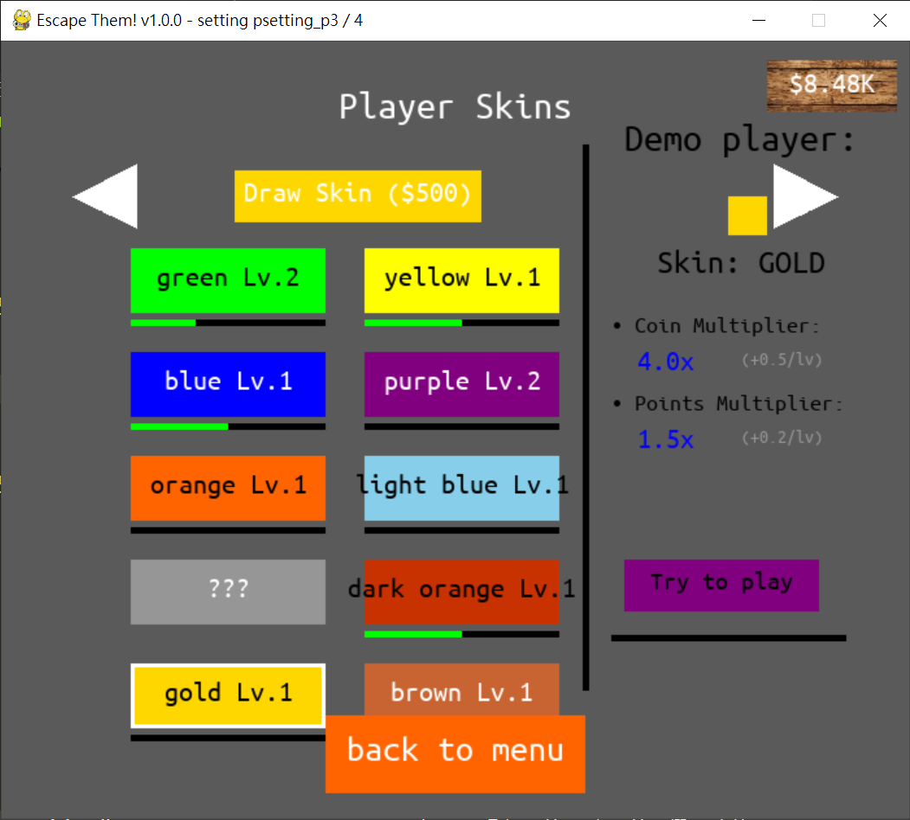
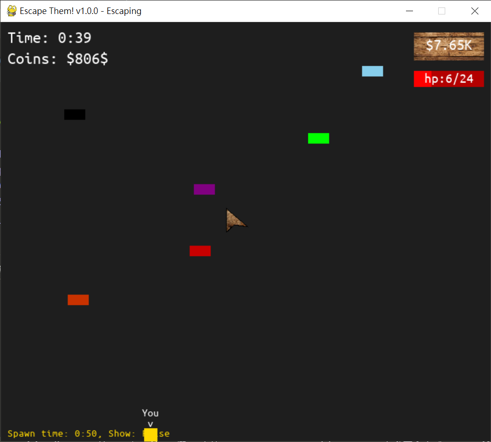
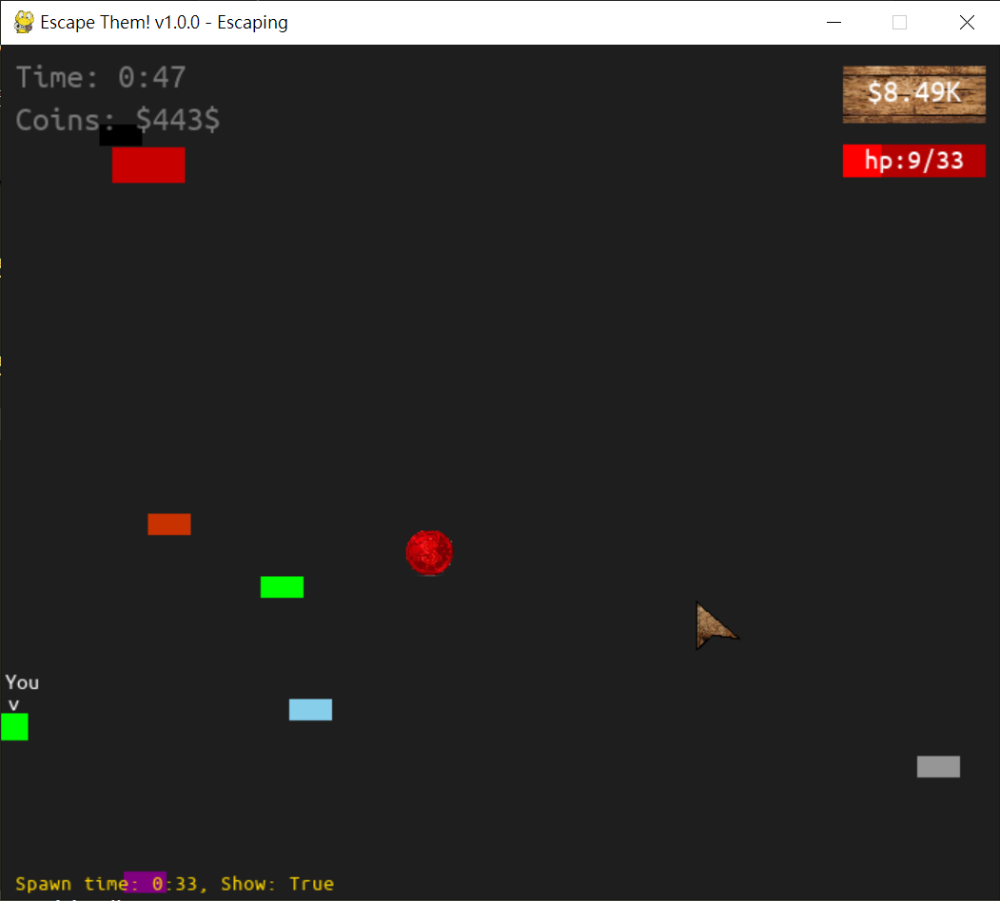
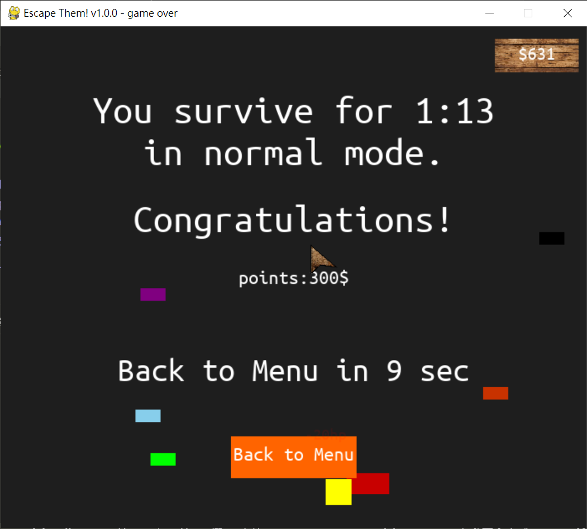
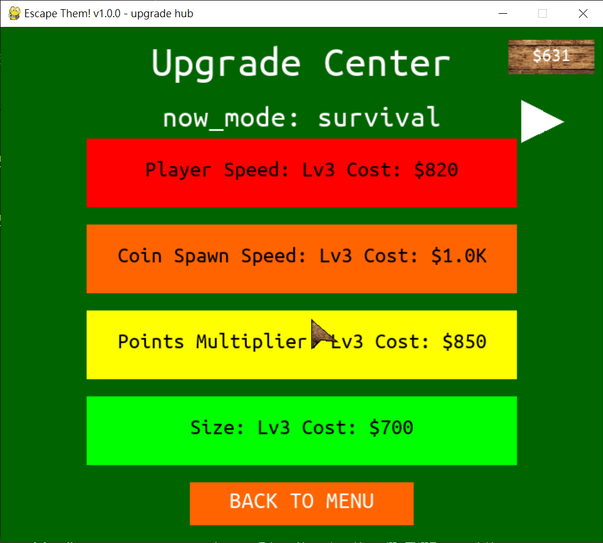
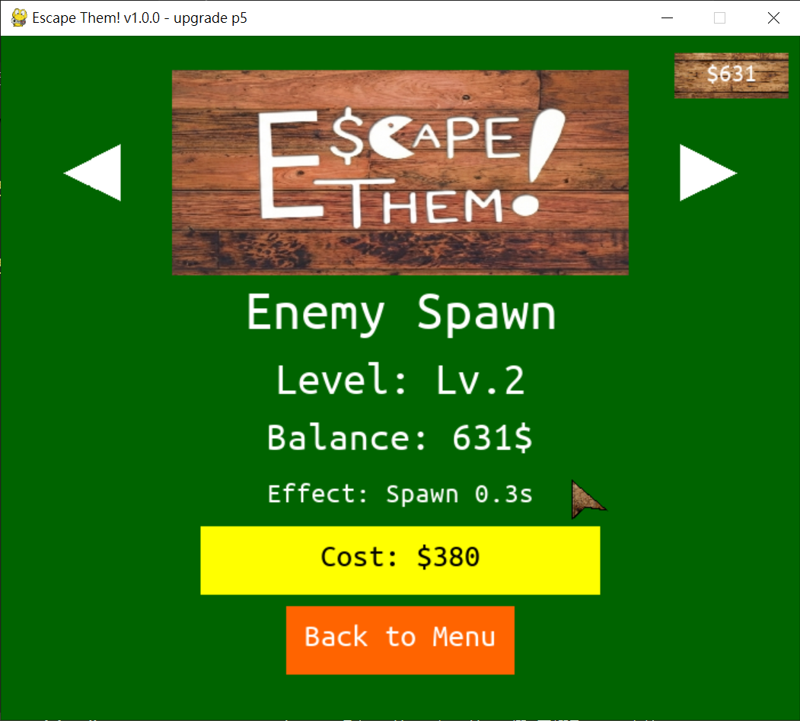

# 🎮 Escape Them!

## Logo 


一個由 Python 與 Pygame 開發的快節奏生存遊戲。躲避不斷湧現的怪物，賺取金錢，並打造最強的玩家屬性！

## 🚀 遊戲特色
- **多樣化升級**：超過 14 種可升級屬性，從速度到磁鐵範圍，應有盡有。
- **皮膚系統**：獨特的皮膚轉蛋機制，每款皮膚都有專屬的加成與成長性。
- **動態難度**：隨生存時間增加，敵人傷害與數量會不斷提升。

## 🛠️ 屬性與武裝升級 (Upgrades)

遊戲包含多達 17 種可強化的項目，現已分為「生存」與「射擊」兩大體系：

### 🛡️ 基礎生存與防禦
1. **機動力**：玩家速度提升。
2. **生命管理**：最大血量、回血速度、無敵時間、閃避機率。
3. **體型控制**：縮小玩家體型（減少受傷面積）。
4. **資源獲取**：金幣生成、分數倍率、磁鐵範圍/吸力、錢幣運氣。
5. **環境影響**：延長怪物生成速度。

### 🔫 武裝射擊系統 (預告 ! )
這是一套全新的主動防禦系統，讓玩家不再只是被動逃跑：
* **解鎖射擊 (Can Shoot)**：花費 $5,000 解鎖攻擊能力。
* **射擊頻率 (Shoot CD)**：升級以縮短冷卻時間，最高可達每 1 秒發射一次。
* **彈道速度 (Bullet Speed)**：大幅提升子彈飛行速度，更精準擊中目標。

---

## 🎨 皮膚系統 (Skins)
每個顏色不僅是外觀，還自帶獨特的**屬性加成**與**成長曲線**。
- 透過抽獎系統抽取新皮膚。
- 等級越高，加成越強（例如：Enemy Damage 最低可降至 0.1x）。

## 🎮 如何開始
### 安裝環境
確保你已安裝 Python 與 Pygame：
```bash
pip install pygame
```
還有 pathlib：
```bash
pip install pathlib
```
並在終端機內打入：
```bash
python + 這個資料夾的路徑 + main.py
```

# 遊玩畫面

## 主畫面 

## 設定第三頁 

## Level1 

## Level2 

## 死亡畫面 

## 升級總表 

## 升級畫面 